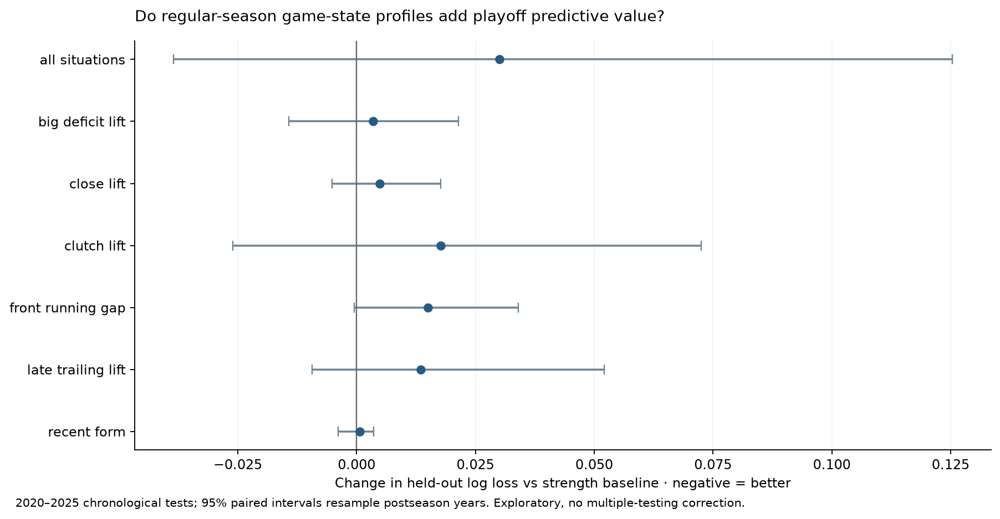

# Do game-state profiles predict playoff overperformance?

## Answer

No situation model improves historical log loss with a paired year-bootstrap interval entirely below zero. Every individual signal and the joint model has a worse historical mean log loss than the strength baseline. This is a retrospective chronological backtest, not a preregistered or live betting result. Do not equate a season-specific profile with a durable playoff trait.

The sample covers 2015–16 through 2025–26: eleven completed postseasons, 165 series and 176 playoff team-seasons before possession-coverage filtering. Train first on 2016–2019, test 2020, then expand the training window one year at a time. The historical comparison ends at 2025; 2026 is reported separately as the final chronological holdout. All regular-season inputs are frozen before that postseason, including actual playoff seeds after the play-in. We do not predict play-in qualification.

The strength baseline's historical test accuracy is 64.0%, Brier score 0.221 and log loss 0.632. The main question is whether a situation feature improves those probabilities on the **same held-out matchups**, rather than whether it correlates with playoff wins in the same sample.

## Historical predictive comparison

Lower log loss and Brier score are better. Negative loss change favors adding the feature. Accuracy alone ignores confidence and can obscure worse probability estimates.

| model | series | log_loss | brier | accuracy | log_loss_change | change_ci_low | change_ci_high |
| --- | --- | --- | --- | --- | --- | --- | --- |
| Baseline + all situations | 89 | 0.662 | 0.217 | 0.663 | 0.030 | -0.038 | 0.125 |
| Baseline + big_deficit_lift | 89 | 0.635 | 0.221 | 0.629 | 0.003 | -0.014 | 0.021 |
| Baseline + close_lift | 89 | 0.636 | 0.219 | 0.640 | 0.005 | -0.005 | 0.018 |
| Baseline + clutch_lift | 89 | 0.649 | 0.220 | 0.652 | 0.018 | -0.026 | 0.073 |
| Baseline + front_running_gap | 89 | 0.647 | 0.225 | 0.629 | 0.015 | -0.000 | 0.034 |
| Baseline + late_trailing_lift | 89 | 0.645 | 0.221 | 0.652 | 0.014 | -0.009 | 0.052 |
| Baseline + recent form | 89 | 0.632 | 0.221 | 0.629 | 0.001 | -0.004 | 0.004 |
| Seed + home court | 89 | 0.645 | 0.225 | 0.640 | 0.014 | -0.005 | 0.033 |
| Strength baseline | 89 | 0.632 | 0.221 | 0.640 | 0.000 | 0.000 | 0.000 |



## Final 2026 holdout

| model | series | log_loss | brier | accuracy | log_loss_change | change_ci_low | change_ci_high |
| --- | --- | --- | --- | --- | --- | --- | --- |
| Baseline + all situations | 15 | 0.685 | 0.244 | 0.600 | 0.063 | — | — |
| Baseline + big_deficit_lift | 15 | 0.644 | 0.229 | 0.600 | 0.021 | — | — |
| Baseline + close_lift | 15 | 0.602 | 0.211 | 0.600 | -0.021 | — | — |
| Baseline + clutch_lift | 15 | 0.658 | 0.233 | 0.600 | 0.035 | — | — |
| Baseline + front_running_gap | 15 | 0.624 | 0.221 | 0.600 | 0.001 | — | — |
| Baseline + late_trailing_lift | 15 | 0.621 | 0.221 | 0.600 | -0.002 | — | — |
| Baseline + recent form | 15 | 0.652 | 0.231 | 0.667 | 0.029 | — | — |
| Seed + home court | 15 | 0.615 | 0.215 | 0.667 | -0.008 | — | — |
| Strength baseline | 15 | 0.623 | 0.221 | 0.600 | 0.000 | — | — |

One postseason has only fifteen series. A favorable 2026 result alone cannot establish reliability, particularly because these questions were motivated by inspecting 2026 regular-season profiles.

## What overachieving means

Start with the actual first-round bracket and predict every possible later matchup from **regular-season** team strength, seed and home court. Integrate the bracket exactly to calculate each entrant's expected number of series wins, conference-finals/Finals probabilities and title probability. Never plug in its eventual later opponents when calculating preseason expectations. Expected series wins sum to fifteen and title probabilities sum to one.

Overperformance = actual series wins − strength-baseline expected series wins. A positive residual means a deeper run than this model expected from that team's quality and draw. This is model-relative, not a verdict about coaching or mentality. It also does not represent market expectations or betting odds. Later-round series-level predictions are conditional on the actual matchup; the bracket expectation is the separate pre-first-round measure.

| season | team | seed | wins | games | srs | actual_series_wins | expected_series_wins | overperformance | title_probability |
| --- | --- | --- | --- | --- | --- | --- | --- | --- | --- |
| 2023 | MIA | 8.00 | 44 | 82 | -0.13 | 3 | 0.08 | 2.92 | 0.00 |
| 2024 | DAL | 5.00 | 50 | 82 | 2.30 | 3 | 0.54 | 2.46 | 0.01 |
| 2025 | IND | 4.00 | 50 | 82 | 1.68 | 3 | 0.71 | 2.29 | 0.01 |
| 2026 | NYK | 3.00 | 53 | 82 | 6.05 | 4 | 1.26 | 2.74 | 0.05 |
| 2026 | CLE | 4.00 | 52 | 82 | 3.79 | 2 | 0.91 | 1.09 | 0.02 |
| 2026 | SAS | 2.00 | 62 | 82 | 8.28 | 3 | 2.04 | 0.96 | 0.18 |
| 2026 | OKC | 1.00 | 64 | 82 | 11.04 | 2 | 2.51 | -0.51 | 0.34 |
| 2026 | HOU | 5.00 | 52 | 82 | 4.87 | 0 | 0.68 | -0.68 | 0.01 |
| 2026 | BOS | 2.00 | 56 | 82 | 7.37 | 0 | 1.78 | -1.78 | 0.12 |

All sixteen 2026 entrants:

| team | seed | win_pct | point_diff | srs | actual_series_wins | expected_series_wins | overperformance | joint_expected_series_wins |
| --- | --- | --- | --- | --- | --- | --- | --- | --- |
| NYK | 3.00 | 0.65 | 6.33 | 6.05 | 4 | 1.26 | 2.74 | 0.99 |
| CLE | 4.00 | 0.63 | 4.12 | 3.79 | 2 | 0.91 | 1.09 | 0.88 |
| SAS | 2.00 | 0.76 | 8.30 | 8.28 | 3 | 2.04 | 0.96 | 1.37 |
| PHI | 7.00 | 0.55 | -0.18 | -0.27 | 1 | 0.21 | 0.79 | 0.20 |
| MIN | 6.00 | 0.60 | 3.35 | 3.07 | 1 | 0.42 | 0.58 | 0.60 |
| LAL | 4.00 | 0.65 | 1.76 | 1.68 | 1 | 0.64 | 0.36 | 0.48 |
| PHX | 8.00 | 0.55 | 1.46 | 1.74 | 0 | 0.11 | -0.11 | 0.13 |
| POR | 7.00 | 0.51 | -0.29 | -0.28 | 0 | 0.13 | -0.13 | 0.38 |
| ORL | 8.00 | 0.55 | 0.63 | 0.81 | 0 | 0.15 | -0.15 | 0.17 |
| ATL | 6.00 | 0.56 | 2.41 | 2.38 | 0 | 0.37 | -0.37 | 0.58 |
| TOR | 5.00 | 0.56 | 2.83 | 2.75 | 0 | 0.50 | -0.50 | 0.45 |
| OKC | 1.00 | 0.78 | 11.15 | 11.04 | 2 | 2.51 | -0.51 | 2.29 |
| HOU | 5.00 | 0.63 | 5.22 | 4.87 | 0 | 0.68 | -0.68 | 1.09 |
| DEN | 3.00 | 0.66 | 5.15 | 4.97 | 0 | 1.06 | -1.06 | 1.17 |
| DET | 1.00 | 0.73 | 8.16 | 7.53 | 1 | 2.24 | -1.24 | 2.24 |
| BOS | 2.00 | 0.68 | 7.70 | 7.37 | 0 | 1.78 | -1.78 | 1.99 |

### Direct test of predicting the depth of a playoff run

Compare each team's actual series wins with its pre-first-round bracket expectation. Both models use the same complete brackets; a year with an entrant below the situation coverage floor is excluded from both sides of this comparison. These team outcomes are dependent, so uncertainty again resamples whole postseason years. RMSE and MAE are in series wins; negative MSE change favors adding all situation features.

| sample | team_seasons | seasons | baseline_rmse | joint_rmse | baseline_mae | joint_mae | mse_change | change_ci_low | change_ci_high |
| --- | --- | --- | --- | --- | --- | --- | --- | --- | --- |
| Historical test through 2025 | 80 | 5 | 1.080 | 1.092 | 0.816 | 0.794 | 0.026 | -0.157 | 0.251 |
| 2026 final holdout | 16 | 1 | 1.051 | 1.196 | 0.815 | 0.935 | 0.325 | — | — |
| All chronological test years | 96 | 6 | 1.075 | 1.110 | 0.816 | 0.818 | 0.076 | -0.109 | 0.278 |

This tests whether the profiles identify overachievers before their run, rather than fitting a story to the eventual winners. The historical joint model slightly improves absolute error but slightly worsens squared error; the paired interval includes zero. That is mixed evidence, not a reliable improvement.

### Reading the team examples

Miami 2023, Dallas 2024 and Indiana 2025 all had positive clutch lifts and deep runs beyond baseline expectation. However, those selected examples do not validate the rule: Milwaukee 2021 won the championship despite a negative clutch lift, and Minnesota 2025 reached the conference finals with a strongly negative clutch lift. Dallas 2024 also had a positive frontrunning gap, showing that a relatively better leading-state profile does not preclude a successful run. In 2026 Cleveland and San Antonio's behind-state strength accompanied overperformance, but Denver's did not. The joint model lowered the eventual champion New York's expected run from 1.26 to 0.99 series wins. These are diagnostic counterexamples, not causal explanations.

## Controls and game-state features

- The baseline compares **both teams**: regular-season win percentage, average point differential per game, schedule-adjusted point differential (SRS), actual playoff seed and series home-court advantage. SRS solves point margin = own rating − opponent rating, with league mean zero. It adjusts for the strength of the full regular-season schedule rather than treating identical records as identical teams.
- Home court is zero for the 2020 bubble. In bracket integration it belongs to the higher seed within a conference; Finals home court uses regular-season win percentage, wins, then SRS as an explicit proxy for rare tied-record tiebreaks. Actual series evaluation uses the scheduled Game 1 home team. Seed comparisons in the Finals retain each team's conference seed.
- Situation metrics use signed **possession-start** margin and remaining clock. Benchmarks exclude the focal team and match season, margin and time. Positive offense/defense residuals always mean better. No playoff possessions enter these features.
- Shrink each offensive and defensive residual with 200 neutral possessions. State lifts subtract the team's shrunk overall league-relative net. This emphasizes performance above its usual level and reduces noisy small-state extremes. Missing state exposure is assigned a neutral zero lift. Individual-state display floors are not a predictive inclusion rule; low-count states remain heavily shrunk and their counts are exported.
- `front_running_gap`: shrunk relative net ahead 11+ minus behind 11+, excluding the final two regulation minutes. Positive means relatively stronger while ahead. The other signals are big-deficit lift (also excluding final two), close-game lift (within five), clutch lift (final five minutes or OT within five), and late-trailing lift (down 1–10 in Q4/OT).
- Test each of the five signals separately and all together. Fit symmetric logistic models with **no intercept**, training-only RMS scaling, and fixed L2 penalty 2. Swapping opponents complements the prediction. Wins, margin and SRS are correlated; regularization limits unstable coefficients rather than treating each as independent evidence. `Baseline + recent form` adds last-twenty-game point differential as a non-situation comparison.
- Situation models and the matched baseline use identical training/evaluation series. Exclude a matchup if either team has possession coverage below 80% of its accepted regular-game total. The strength-only bracket expectation can still cover all sixteen entrants; its joint-model counterpart is omitted for years with an entrant below the coverage floor. Actual playoff wins always come from the complete bracket, including any series excluded from prediction evaluation.

## Persistence and robustness

Year-to-year correlations compare the same franchise's successive regular-season signals, not roster continuity. Weak persistence can coexist with predictive value, but undermines calling a profile a lasting identity.

| signal | adjacent_team_seasons | pearson_correlation |
| --- | --- | --- |
| front_running_gap | 295 | 0.117 |
| big_deficit_lift | 295 | 0.207 |
| close_lift | 295 | 0.116 |
| clutch_lift | 295 | 0.074 |
| late_trailing_lift | 295 | 0.068 |

Sensitivity checks include L2 penalties 0.5 and 8, excluding 2020, excluding the 2026 provider change, first rounds alone, only teams with ≥90% possession-game coverage, and opponent-adjusted state profiles. That last check shifts each offensive/defensive possession's expected points by its opponent's regular-season defensive/offensive deviation from league average, then applies the same shrinkage and state lifts. This addresses easier opponents within a state as a limited additive sensitivity; it does not estimate opponent-by-state or lineup interactions. Negative loss changes favor adding all situations.

| check | series | baseline_log_loss | joint_log_loss | joint_change |
| --- | --- | --- | --- | --- |
| L2 0.5 | 104 | 0.648 | 0.698 | 0.050 |
| L2 8 | 104 | 0.615 | 0.637 | 0.022 |
| Exclude 2020 | 89 | 0.643 | 0.673 | 0.030 |
| Exclude 2026 | 89 | 0.632 | 0.662 | 0.030 |
| First round only | 55 | 0.510 | 0.542 | 0.032 |
| Coverage ≥90% | 104 | 0.630 | 0.665 | 0.035 |
| Opponent-adjusted states | 104 | 0.630 | 0.660 | 0.030 |

Annual held-out performance and standardized coefficients are exported. Confidence intervals resample **whole postseason years**, pairing baseline and augmented losses for the same series (5,000 draws, seed 19). This accounts for within-postseason dependence but only six historical test years remain; intervals are coarse and do not include every source of training/model uncertainty. Five individual signals, a joint model and multiple sensitivities are exploratory comparisons, without multiplicity correction. Selecting whichever model looks best after this test would require a new validation sample.

## Data coverage and audit

| season | regular_games | possession_games | postseason_games | series | minimum_team_coverage |
| --- | --- | --- | --- | --- | --- |
| 2016 | 1230 | 1218 | 86 | 15 | 0.98 |
| 2017 | 1230 | 1221 | 79 | 15 | 0.96 |
| 2018 | 1230 | 1157 | 82 | 15 | 0.48 |
| 2019 | 1230 | 1203 | 82 | 15 | 0.79 |
| 2020 | 1056 | 1040 | 83 | 15 | 0.95 |
| 2021 | 1080 | 1046 | 85 | 15 | 0.92 |
| 2022 | 1230 | 1166 | 87 | 15 | 0.68 |
| 2023 | 1230 | 1199 | 84 | 15 | 0.94 |
| 2024 | 1230 | 1210 | 82 | 15 | 0.95 |
| 2025 | 1230 | 1215 | 84 | 15 | 0.96 |
| 2026 | 1230 | 1217 | 85 | 15 | 0.96 |

2 series are excluded from the paired prediction dataset by the 80% team coverage rule. Exact IDs and reasons are in `playoff_prediction_audit.json`. Data gaps can be selective, not random. Legacy normalization first preserves fully score-reconciled exact FT matches; fallback matching removes historical suffix/initial/diacritic and FT-sequence annotation inconsistencies, verifies shooter/team/period/clock and made counts, and admits a recovered game only after per-team and final-score reconciliation. These inputs have a separate canonical cache. The four-season app keeps its stricter exact-description FT matching; its reports were also refreshed for the corrected final-score ordering.

Regular standings and playoff results use completed NBA cumulative game scores with independently identified home/away teams. Exact duplicated event rows are removed. Historical corrected events can have late event IDs while referring to an earlier period; cumulative scores are therefore ordered by period and remaining clock before event ID. Conflicting event-point tallies are flagged separately and do not override an unambiguous completed scoreboard. Any game with a tied or ambiguous final score is excluded. All source regular games are accepted in this run, including all 1,230 games in 2026. Baseline rates use win percentage, so shortened seasons are comparable.

Sources: [public NBA event/possession archives](https://github.com/shufinskiy/nba_data), with source hashes and exclusions in the audit. The bulk 2026 playoff archive contains only 60 games. Supplement its 25 missing later-round games from the [NBA's completed 2026 schedule](https://www.nba.com/news/2026-nba-playoffs-schedule), stored as auditable factual metadata in `backend/analysis/metadata/playoffs_2026.json`. Every overlapping later-round game agrees in teams and score. Validate all eleven postseasons as complete 8–4–2–1 series brackets, with exactly four wins for every series winner. Seeds come from first-round bracket slots and Game 1 home court, not regular-season win sorting or eventual advancement.

## Basketball interpretation

This controls seed, broad opponent quality and draw, but does not encode who was healthy, trade-deadline rotation changes, which regular-season minutes involved the playoff rotation, or matchup-specific shot/turnover/rebounding weaknesses. Recent form is a limited sensitivity, not an injury model. A postseason upset can reflect availability or matchup fit without validating a clutch or frontrunner trait. The model excludes betting odds, which could reflect those facts better than these inputs.

Winning efficiently while down big is not the same as winning a playoff game or making a comeback. Reserves, tactical responses, intentional fouling and state selection can affect the metrics. Compare a situational signal with a strong baseline first, require repeatable held-out improvement, and then inspect the basketball mechanism in individual series.

## Reproduce

```sh
.venv/bin/pip install -e '.[dev]'
.venv/bin/python -m backend.analysis.playoff_run --download --seasons 2016 2017 2018 2019 2020 2021 2022 2023 2024 2025 2026
.venv/bin/python -m pytest -q
```

Outputs: team features/counts, complete playoff series, paired series features, chronological predictions, annual losses, coefficients, model summaries, bracket expectations/residuals, persistence, sensitivity results and full audits. See `playoff_*.csv` and `playoff_prediction_audit.json`. Figures are exported as PNG and SVG.
